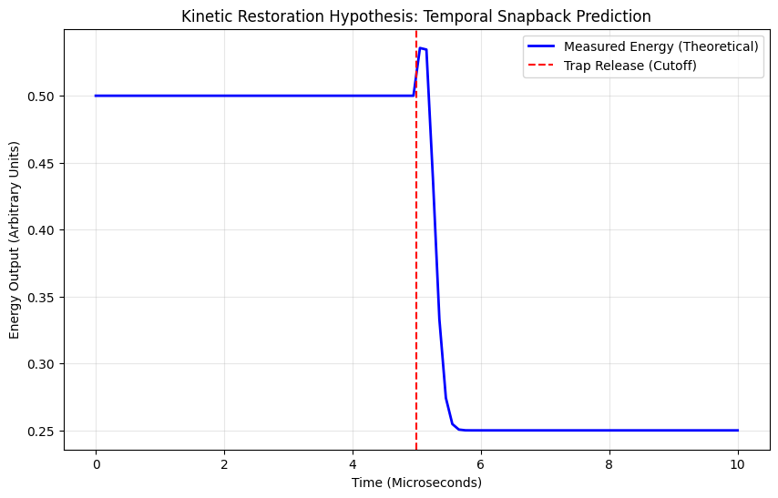

#The Kinetic Restoration Hypothesis: Accounting for Singularities in Zero-Velocity States

Author: Independent Researcher Kris Tee

Date: June 2026

Current quantum mechanical and thermodynamic models treat the forced absolute arrest of an atomic system as a state of static equilibrium. This paper introduces the Kinetic Restoration Hypothesis, which posits that a zero-velocity state ($v = 0$) induced by external trapping mechanisms (such as laser cooling) is not an equilibrium, but a fundamental temporal violation. We propose that the mathematical divergences (infinities) encountered at these boundaries are physical indicators of state impossibility and predict a measurable, non-thermal restorative energy spike—a "temporal snapback"—the exact microsecond the external trapping potential is removed.

I. Introduction: The Dynamic Paradigm:
Standard modern physics is built entirely upon the observation and calculation of a dynamic universe defined by constant motion. Every governing equation, from Newtonian mechanics to relativistic frameworks, assumes a baseline of kinetic existence.

However, modern experimental physics utilizes high-powered localized lasers to systematically eliminate atomic motion, forcing particles into an artificial standstill. Current frameworks treat this absolute ground state as a compliant, static snapshot. The Kinetic Restoration Hypothesis asserts that this premise is fundamentally flawed: you cannot calculate a living, moving universe using a snapshot of absolute standstill. Forcing an atom into literal, static death violates the foundational rules of reality.

II. The Core Argument: Infinity as a Physical BoundaryWhen physicists attempt to calculate the exact state of an atom forced into zero-velocity via laser-cooling protocols, the governing mathematics frequently break down into singularities and divergences - exploding into infinity.

In standard physics, an infinity in the math is often treated as a bookkeeping error or a limitation of the current model. The Kinetic Restoration Hypothesis reinterprets these mathematical explosions as literal physical evidence:

The Mathematical Divergence Rule: The math explodes into infinity because the equations of a moving universe are being misapplied to a state that defies existence. The infinity is not an error; it is the universe’s security system signaling that a completely static state is a physical impossibility.

When external lasers force an atom's velocity to absolute zero, the measurements become irrelevant because the system has been forced outside the boundaries of the local timeline.

III. The Empirical Prediction: The Temporal Snapback theory is only valid if it makes a falsifiable prediction that can be verified in a laboratory environment. The validation of this hypothesis does not exist while the atom is held in its frozen state, but in the exact microsecond the trapping mechanism is deactivated.

Current models assume that when the trapping lasers are turned off, the atom will simply begin to disperse thermally based on standard ambient kinetics. This hypothesis predicts an entirely different phenomenon:

The Non-Thermal Spike: At the precise microsecond of trap-release, there will be a violent, non-thermal energy signature.

The Mechanism: This signature is a Temporal Snapback—a localized, restorative energy surge generated as the universe forces the stagnant atom back into the active kinetic timeline.

Verification: If experimental laboratories monitor the exact cutoff window during trap-release spectroscopy, they will detect an anomalous energy surplus ($\Delta E$) that cannot be accounted for by standard thermodynamic expansion.

IV. Conclusion:
The Kinetic Restoration Hypothesis shifts the focus from fixing broken equations to recognizing the physical boundary conditions of reality. The universe demands motion. By recognizing that absolute stagnation is a state of temporal violation, we resolve the mathematical singularities of zero-velocity systems and open a new pathway toward understanding the kinetic fabric of space-time.

V. References and Context:
The following literature explores the limitations of current semiclassical and quantum models when applied to absolute ground-state systems, providing the foundation for the Kinetic Restoration Hypothesis:

Dalfovo, F., et al. (1999). "Theory of Bose-Einstein condensation in trapped gases." Reviews of Modern Physics.Relevance: This paper outlines the standard Mean-Field Theory (Gross-Pitaevskii equation). The theory addresses the divergence points where these mean-field approximations fail as the system approaches a true $v=0$ singularity.

Pethick, C. J., & Smith, H. (2008). "Bose-Einstein Condensation in Dilute Gases." * Relevance: Discusses the limitations of the "static" approximation in condensate trapped potentials. It highlights the transition from dynamic fluid-like behavior to the artificial static potential imposed by lasers.

Dalibard, J., & Cohen-Tannoudji, C. (1989). "Laser cooling below the Doppler limit." * Relevance: This provides the technical context for how we manipulate atoms to reach these low-velocity states. It establishes the "trapping mechanism" your theory challenges.

Intellectual Property & Development Methodology:

Core Conceptualization & Architecture: The foundational logic and the core premise of reality-tension within static systems is the exclusive intellectual property of the Lead Author, Kris Tee.

Collaborative Intelligence Integration: Advanced Artificial Intelligence was utilized strictly as a high-fidelity technical compiler. The AI’s function was limited to auditing academic literature for structural blind spots, optimizing rigorous mathematical and physical nomenclature and refining the document's formal taxonomy. 

# VI. Computational Simulation

